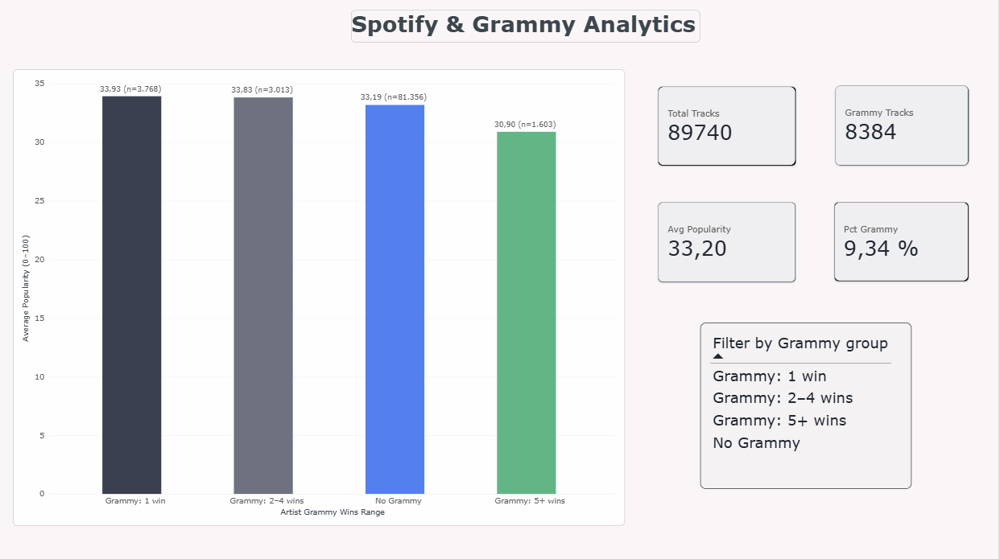
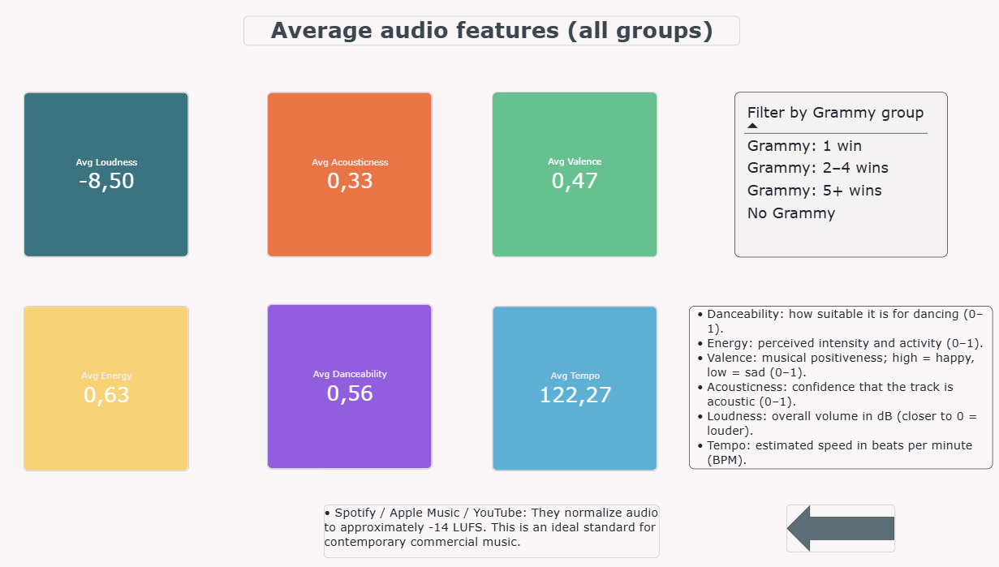

# 🎵 Workshop 2: Reliable Batch Data Pipeline for Spotify and Grammy Awards

A reliable batch data pipeline that integrates **Spotify** track data (CSV) with **Grammy Awards** records (PostgreSQL source database) into a trusted **dimensional Data Warehouse**. The pipeline is orchestrated with **Apache Airflow 3.1.8**, validated with **Great Expectations** at raw and prepared gates, and consumed by a **Power BI** dashboard. Every decision is traceable through requirement (`AR`), KPI, risk (`RK`), quality-rule (`DQ`) and transformation (`TR`) identifiers.

**Author:** Juan Sebastián Torres Pantoja
**Course:** ETL (G01), Universidad Autónoma de Occidente (UAO), Cali, Colombia
**Repo:** https://github.com/Juanseto2903/Workshop-2

---

## Table of contents

1. [Problem and analytical objective](#-1-problem-and-analytical-objective)
2. [Data sources](#-2-data-sources)
3. [Environment](#-3-environment)
4. [Repository structure](#-4-repository-structure)
5. [Analytical requirements](#-5-analytical-requirements)
6. [Data profiling findings](#-6-data-profiling-findings)
7. [Quality risks and quality rules](#-7-quality-risks-and-quality-rules)
8. [Great Expectations validation design](#-8-great-expectations-validation-design)
9. [Transformation and integration strategy](#-9-transformation-and-integration-strategy)
10. [Dimensional model](#-10-dimensional-model)
11. [Data Warehouse loading](#-11-data-warehouse-loading)
12. [Airflow DAG design](#-12-airflow-dag-design)
13. [Reliability tests](#-13-reliability-tests)
14. [Dashboard and KPIs](#-14-dashboard-and-kpis)
15. [Setup and execution](#-15-setup-and-execution)
16. [Troubleshooting](#-16-troubleshooting)
17. [Assumptions and limitations](#-17-assumptions-and-limitations)

---

## 🎯 1. Problem and analytical objective

The project builds a reliable batch pipeline that integrates two heterogeneous sources, a Spotify track catalog (CSV) and Grammy Awards records (PostgreSQL), into a dimensional Data Warehouse that answers three analytical requirements:

- **AR-01:** How does the average Spotify popularity of tracks differ according to the Grammy recognition of their artists: no Grammy, 1 Grammy, 2–4 Grammys, or 5+ Grammys? (KPI-01)
- **AR-02:** How do the average audio characteristics of tracks classified as Grammy-recognized compare with No-Grammy tracks and with the most popular tracks? (KPI-02)
- **AR-03:** Is explicit content more prevalent among tracks classified as Grammy-recognized than among No-Grammy tracks? (KPI-03)

**Out of scope.** Time-based analysis (the Spotify file has no dates) and causal inference (popularity is a single point-in-time value, not a historical series). Results are reported as **associations between groups**, not as effects of the award.

---

## 📥 2. Data sources

| Source | Provided form | Extraction source |
|--------|---------------|-------------------|
| Spotify | CSV file | `data/raw/spotify_dataset.csv` |
| Grammy Awards | CSV file | PostgreSQL table `grammy_awards` in the `grammy_source` database |

The Grammy CSV is loaded once into a PostgreSQL source table (source preparation, not the final ETL load). The pipeline extracts Grammy data from the relational database, not directly from the CSV. The load is reconciled: the CSV row count (4,810) must equal the table row count, otherwise the script stops with an error.

---

## 🐳 3. Environment

| Component | Tool |
|-----------|------|
| Orchestrator | Apache Airflow 3.1.8 (Docker Compose, CeleryExecutor) |
| DAG authoring | Python, Airflow TaskFlow API (`from airflow.sdk import dag, task`) |
| Databases | PostgreSQL 16 (`warehouse-db` service) hosting `grammy_source` (operational source) and `music_dw` (Data Warehouse), separate from the Airflow metadata database (`postgres` service) |
| Staging | Parquet |
| Validation | Great Expectations (GX Core 1.x) |
| BI tool | Power BI Desktop |
| Secrets | Local `.env` (excluded from version control); `.env.example` documents the required variables |

### Environment variables

Required in `.env`:

```env
AIRFLOW_UID=50000
WH_USER=change_me
WH_PASSWORD=change_me
```

`WH_HOST` and `WH_PORT` are injected by `docker-compose.yaml` for Airflow containers (`warehouse-db:5432`) and default to `localhost:5433` for commands run from the host machine. **Do not set them in `.env`.**

---

## 📁 4. Repository structure

```
workshop-2/
│
├── dags/
│   └── reliable_music_pipeline.py          # Airflow 3.1.8 DAG (TaskFlow API, 8 tasks)
│
├── src/
│   ├── __init__.py
│   ├── extract.py                          # Extraction to Parquet staging (Spotify + Grammy)
│   ├── transform.py                        # Transformation and integration (TR-01 to TR-14)
│   ├── load.py                             # Idempotent load into the DW
│   ├── load_grammy_source.py               # One-time load of the Grammy CSV into grammy_source
│   ├── paths.py                            # Project paths
│   └── validation/
│       ├── __init__.py
│       ├── __main__.py                     # CLI: setup, run, mapping, check-contract
│       ├── rules.py                        # Single source of truth (DQ-01 to DQ-12)
│       ├── suites.py                       # Builds GX suites from rules.py
│       ├── gates.py                        # GX context, checkpoints, gate runner
│       └── evaluate.py                     # Severity policy + evidence writing
│
├── gx/                                     # Great Expectations project (file-based)
│   ├── great_expectations.yml
│   ├── expectations/                       # Saved suites
│   ├── checkpoints/                        # Saved checkpoints
│   └── uncommitted/                        # Data Docs and validations
│
├── notebooks/
│   └── data_profiling.ipynb                # Reproducible profiling of both sources
│
├── sql/
│   ├── init_databases.sql                  # Creates grammy_source and music_dw on container start
│   ├── source_setup.sql                    # grammy_awards table in grammy_source
│   └── dw_schema.sql                       # DW schema + seeded fixed dimensions
│
├── images/                                 
│   └── Dimensional Modeling.png
│
├── docs/
│   ├── design_document.docx                # Design document (Sections 1 to 13)
│   ├── dw_model.dbml                       # Source of the dimensional model diagram
│   ├── dashboard_music_dw.pbix             # Power BI dashboard (3 pages)
│   └── evidence/
│       ├── README.md                       # Evidence register (E-01 to E-10)
│       ├── grammy_source_reconciliation.json
│       ├── profiling/                      # Profiling results
│       ├── validation/
│       │   ├── spotify_raw_latest.json
│       │   ├── grammys_raw_latest.json
│       │   ├── prepared_latest.json
│       │   ├── expectation_rule_mapping.csv
│       │   └── history/                    # Timestamped copies of every run
│       ├── reliability/                    # Screenshots and logs of Tests A, B, C
│       └── dashboard/
│           ├── queries.sql                 # The 3 KPI queries (KPI-01 to KPI-03)
│           ├── KPI-01.png
│           ├── KPI-02.png
│           └── KPI-03.png
│
├── data/
│   ├── raw/
│   │   ├── spotify_dataset.csv             # Spotify source (immutable)
│   │   └── the_grammy_awards.csv           # Grammy source (immutable)
│   └── staging/                            # Parquet (regenerated on every run, not versioned)
│       ├── spotify_raw.parquet
│       ├── grammys_raw.parquet
│       ├── prepared_tracks.parquet
│       ├── grammy_artist_match.parquet
│       ├── bridge_track_genre.parquet
│       ├── bridge_track_grammy_category.parquet
│       └── dim_grammy_category_prepared.parquet
│
├── logs/                                   # Airflow logs (not versioned)
├── config/                                 # Airflow configuration (not versioned)
├── plugins/                                # Airflow plugins (empty)
│
├── requirements.txt                        # Python dependencies
├── Dockerfile                              # Airflow image (build: .)
├── docker-compose.yaml                     # Airflow 3.1.8 + PostgreSQL + Redis
├── .env                                    # Secrets (NOT versioned)
├── .env.example                            # Template (versioned)
├── .gitignore                              # Excludes .env, logs, staging, __pycache__, etc.
└── README.md                               # Main repository documentation
```

---

## 📋 5. Analytical requirements

See the design document, Tables 1 and 10, for the full traceability. Summary:

| ID | Question | Required data | Source(s) | KPI | Level of detail |
|----|----------|---------------|-----------|-----|-----------------|
| AR-01 | Popularity by Grammy recognition | Spotify: `artists`, `track_id`, `popularity`. Grammy: `artist`. | Spotify + Grammy | KPI-01 | Unique track, classified by Grammy recognition |
| AR-02 | Audio features by group | Spotify: audio features + `popularity`. Grammy: `artist`. | Spotify + Grammy | KPI-02 | Unique track, classified by Grammy recognition and popularity tier |
| AR-03 | Explicit content prevalence | Spotify: `explicit`, `track_id`. Grammy: `artist`, `category`. | Spotify + Grammy | KPI-03 | Unique track, by recognition group and category |

**Why both sources are necessary.** The Grammy source states who was recognized but has no audio characteristics or popularity, and the Spotify source describes tracks but has no recognition information.

### Group definitions

- **Grammy artist:** an artist present in at least one Grammy record after name normalization. Each record is treated as one Grammy win.
- **No-Grammy artist:** an artist in the Spotify catalog with no match in the Grammy records of this dataset.
- **Grammy-recognized track:** a Spotify track with at least one artist classified as a Grammy artist. For tracks with several artists, the highest win count among them determines the win range.
- **Most popular track:** a track at or above the 90th percentile of `popularity` (tier "Most popular").

---

## 🔍 6. Data profiling findings

Reproducible notebook: `notebooks/data_profiling.ipynb`. Result tables: `docs/evidence/profiling/`.

| Measure | Spotify (CSV) | Grammy (PostgreSQL) |
|---------|---------------|---------------------|
| Rows / columns | 114,000 / 21 | 4,810 / 11 |
| Grain evidence | 89,741 distinct `track_id` | 4,430 year-category combinations |
| Exact duplicate rows | 450 | 0 |
| Missing values in key attribute | `artists`: 1 (0.001%) | `artist`: 1,840 (38.25%) |
| Temporal coverage | Not available | 1958–2019, no gaps |
| Categorical content | 114 genres, 1,000 rows each | 638 distinct categories |

**Cross-source consistency.** After normalization v2, 46.42% of Grammy rows with an artist match Spotify (28.02% of all rows). Full evidence in Section 3.4 of the design document.

---

## 🧪 7. Quality risks and quality rules

Risks (RK-01 to RK-17) are listed in Table 5 of the design document. They were derived from profiling evidence only; no rule was chosen because the current batch passes it.

The 12 quality rules (DQ-01 to DQ-12) are in Table 13 of the design document, with thresholds justified in Table 14.

| Layer | Rules | Severity |
|-------|-------|----------|
| Spotify raw | DQ-01 to DQ-05 | 2 Critical, 3 Warning |
| Grammy raw | DQ-06 to DQ-08 | 2 Critical, 1 Warning |
| Prepared | DQ-09 to DQ-12 | 2 Critical, 1 Warning, 1 Informational |

**Severity policy**

| Severity | Pipeline response |
|----------|-------------------|
| Critical | The gate raises `DataQualityError`; downstream tasks are skipped; no automatic retry (the failure is deterministic). |
| Warning | Recorded in the log and in the evidence file; the flow continues. |
| Informational | Recorded for interpretation; never blocks. |

---

## ✅ 8. Great Expectations validation design

The rule definitions live in a single module, `src/validation/rules.py`. The suites, the Expectation-to-Rule-ID mapping and the severity evaluation are all derived from that file, so the code, the mapping table and the document cannot drift apart.

### GX objects

- Data source: `staging_pandas` (one DataFrame asset per dataset).
- Suites: `spotify_raw_suite`, `grammys_raw_suite`, `prepared_tracks_suite`, `grammy_artist_match_suite` (43 expectations in total).
- Validation definitions: one per dataset.
- Checkpoints: one per dataset; each updates Data Docs.

### Gates and DAG tasks

| Gate | DAG task | Input | Rules |
|------|----------|-------|-------|
| Spotify raw | `validate_spotify_raw` | `data/staging/spotify_raw.parquet` | DQ-01 to DQ-05 |
| Grammy raw | `validate_grammys_raw` | `data/staging/grammys_raw.parquet` | DQ-06 to DQ-08 |
| Prepared | `validate_prepared` | `data/staging/prepared_tracks.parquet`, `data/staging/grammy_artist_match.parquet` | DQ-09 to DQ-12 |

### Evidence

Every run writes:

- GX validation results and Data Docs: `gx/uncommitted/`.
- One JSON per gate with the outcome of every rule: `docs/evidence/validation/<gate>_latest.json`, with a timestamped copy under `history/`.
- The complete Expectation → Rule ID mapping: `docs/evidence/validation/expectation_rule_mapping.csv`.

### CLI

```bash
python -m src.validation setup           # create/update GX objects
python -m src.validation mapping         # write the Expectation -> Rule mapping
python -m src.validation check-contract  # verify literals against dw_schema.sql
python -m src.validation run spotify_raw
python -m src.validation run grammys_raw
python -m src.validation run prepared
python -m src.validation run all
```

The exit code is 1 when a Critical rule fails.

---

## 🔧 9. Transformation and integration strategy

Full decision record in Section 7 of the design document (TR-01 to TR-14). Summary:

| Rule | Purpose |
|------|---------|
| TR-01 | One row per unique `track_id`. |
| TR-02 | Popularity averaged across repeated rows of the same track. |
| TR-03 | Tempo 0 → NULL. |
| TR-04 | Record with null critical attributes excluded and logged. |
| TR-05 | Artist key normalization (lower case, accents removed, "&" → "and", punctuation removed, leading "the" dropped). |
| TR-06 | Each Grammy record counts as one win per matched artist. |
| TR-07 | Track classified as Grammy-recognized if any artist has ≥1 win; win range from the highest win count. |
| TR-08 | Popularity tier = "Most popular" if `popularity` ≥ 90th percentile (recomputed on every run), else "Rest". |
| TR-09 | `explicit` → `explicit_flag` (0/1). |
| TR-10 | `track_count` = 1. |
| TR-11 | Genre preserved through `Bridge_Track_Genre`. |
| TR-12 | Grammy category grouping with an explicit "Other" bucket. |
| TR-13 | `track_name` and `album_name` truncated to 500 characters to fit the declared column width. |
| TR-14 | `Bridge_Track_Grammy_Category` built from artist–category relationships. |

### Integration contract

| Item | Decision |
|------|----------|
| Integration key | Normalized artist name (`artist_key`). |
| Cardinality | Many-to-many. |
| Preprocessing | Normalization v2. Spotify artists split on ";". Grammy strings tried whole and then split on `, ; & and feat featuring`. |
| Unmatched records | Kept and reported; Spotify tracks with no match are No-Grammy. |
| Duplicate matches | Highest win count used; the fact row is not duplicated. |
| Limitations | No fuzzy matching. "No-Grammy" means no Grammy win in this dataset. Coverage ends in 2019. Spotify is a genre-balanced sample. Results are associations. |

### Prepared data contract

The transformation produces:

- `data/staging/prepared_tracks.parquet`: one row per unique `track_id`.
- `data/staging/grammy_artist_match.parquet`: one row per distinct Grammy artist with `matched_flag`.
- `data/staging/bridge_track_genre.parquet`: one row per track-genre pair.
- `data/staging/bridge_track_grammy_category.parquet`: one row per track-category relationship.
- `data/staging/dim_grammy_category_prepared.parquet`: category names and groups.

Two columns exist only to make rules measurable in GX and are not loaded into `Fact_Track`: `is_grammy_track` (DQ-11) and `matched_flag` (DQ-12).

---

## 🧱 10. Dimensional model

**Business process:** measuring the popularity and audio profile of Spotify catalog tracks, classified by the Grammy recognition of their artists.

**Grain:** one row of `Fact_Track` represents one unique Spotify `track_id` in the catalog snapshot.

Genre and Grammy category are multivalued (a track can have several of each), so they connect to the fact through two bridge tables.


| Table | One row represents | Key |
|-------|--------------------|-----|
| `Fact_Track` | One unique Spotify track | Surrogate `track_key`, UNIQUE `track_id` |
| `Dim_Grammy_Recognition` | Recognition-group / win-range combination (4 rows, fixed) | Surrogate `recognition_key`, UNIQUE business key |
| `Dim_Popularity_Tier` | One popularity tier (2 rows, fixed) | Surrogate `popularity_tier_key`, UNIQUE `tier_name` |
| `Dim_Genre` | One Spotify genre (114 rows) | Surrogate `genre_key`, UNIQUE `genre_name` |
| `Dim_Grammy_Category` | One normalized Grammy category | Surrogate `category_key`, UNIQUE `category_name` |
| `Bridge_Track_Genre` | One track-genre pair | Composite PK `(track_key, genre_key)` |
| `Bridge_Track_Grammy_Category` | One track-category relationship | Composite PK `(track_key, category_key)` |

> **Query rule:** queries that do not need genre or category **must not join the bridges**, otherwise a track is counted once per genre or category.

Executable schema: `sql/dw_schema.sql` (idempotent; also seeds the two fixed dimensions). Diagram source: `docs/dw_model.dbml`.

---

## 🏭 11. Data Warehouse loading

Strategy (Section 9 of the design document). The load is **idempotent**: running it again with the same batch produces the same target state.

- **Fixed dimensions** (`dim_grammy_recognition`, `dim_popularity_tier`): seeded once by `sql/dw_schema.sql`; never modified by the load.
- **Derived dimensions** (`dim_genre`, `dim_grammy_category`): UPSERT on the business key.
- **Fact and bridges:** TRUNCATE + INSERT inside one transaction. If the load fails before the COMMIT, the transaction rolls back and the DW keeps its previous state.

### Verified load result

| Target | Rows |
|--------|------|
| `fact_track` | 89,740 |
| `bridge_track_genre` | 113,549 |
| `bridge_track_grammy_category` | 20,732 |
| `dim_genre` | 114 |
| `dim_grammy_category` | 638 |

The one-track difference with respect to the 89,741 distinct `track_id` in profiling is explained by RK-05 (the record with null `artists`, `track_name` and `album_name`, excluded by TR-04).

---

## 🔄 12. Airflow DAG design

The DAG `reliable_music_pipeline` runs on a manual schedule and has **eight tasks**: two independent extract-and-validate branches converge at the transformation, followed by a prepared gate that protects the load.

```
setup_gx ──┬──► extract_spotify ──► validate_spotify_raw ──┐
           │                                               ├──► transform_and_integrate ──► validate_prepared ──► load_dw
           └──► extract_grammys ──► validate_grammys_raw ──┘
```

| Task | Depends on | Purpose |
|------|-----------|---------|
| `setup_gx` | none | Create or update the GX objects once per run. Runs sequentially before any parallel work. |
| `extract_spotify` | `setup_gx` | Copy the Spotify CSV to `data/staging/spotify_raw.parquet`. |
| `extract_grammys` | `setup_gx` | Extract `grammy_awards` from the source database to `data/staging/grammys_raw.parquet`. |
| `validate_spotify_raw` | `extract_spotify` | Run the Spotify raw gate (DQ-01 to DQ-05). |
| `validate_grammys_raw` | `extract_grammys` | Run the Grammy raw gate (DQ-06 to DQ-08). |
| `transform_and_integrate` | both raw validations | Run `src.transform.run()` (TR-01 to TR-14). |
| `validate_prepared` | `transform_and_integrate` | Run the prepared gate (DQ-09 to DQ-12). |
| `load_dw` | `validate_prepared` | Run `src.load.run()`. |

- If a raw gate fails, the transformation and everything downstream are skipped.
- If `validate_prepared` fails, `load_dw` is skipped and the DW keeps its previous state.

### Failure policy

Retries are applied selectively: only to transient operational failures that can succeed on a second attempt without changing the input or the code.

| Condition | Severity / type | Response | Retry? |
|-----------|-----------------|----------|--------|
| Missing Spotify CSV in `data/raw/` | Operational | Task fails with `FileNotFoundError`. | Yes: 2 attempts, 2-minute delay |
| Database not reachable during Grammy extraction | Operational | Task fails with a connection error. | Yes: 2 attempts, 2-minute delay |
| Missing required column in extracted data | Contract | Raw gate fails; downstream tasks skipped. | No |
| Critical GX expectation fails | Data quality | Gate raises `DataQualityError`; DW not modified. | No |
| Warning GX expectation fails | Data quality (warning) | Recorded; flow continues. | No |
| Informational GX expectation fails | Data quality (info) | Recorded; flow continues. | No |

The `extract_*` and `load_dw` tasks use bounded retries. Validation, transformation and setup tasks run with `retries=0` because their failures are deterministic.

---

## 🧯 13. Reliability tests

### 13.1 Test A: Successful run

The full pipeline was executed with the profiled batch. All eight DAG tasks completed with state `success` in approximately 5 minutes 35 seconds.

| Stage | Result |
|-------|--------|
| Extract both sources | Success |
| Raw validation gates | Pass (DQ-01 to DQ-08) |
| Transform and integrate | Success (89,740 unique tracks prepared: 8,384 Grammy and 81,356 No-Grammy; popularity cutoff P90 = 60) |
| Prepared validation | Pass (DQ-09 to DQ-12) |
| Load | Success (89,740 fact rows, 113,549 genre bridge rows, 20,732 category bridge rows, 114 genres, 638 categories) |

### 13.2 Test B: Controlled critical failure

**Injected fault.** A single row in `data/raw/spotify_dataset.csv` was set to `popularity = 150`, violating DQ-02 (Critical).

| Task | State | Reason |
|------|-------|--------|
| `setup_gx` | success | Setup does not read source data. |
| `extract_spotify` | success | Extraction does not validate. |
| `extract_grammys` | success | Independent branch. |
| `validate_spotify_raw` | **failed** | DQ-02: `expect_column_values_to_be_between[popularity]` with `unexpected_count = 1`. |
| `validate_grammys_raw` | success | Independent branch. |
| `transform_and_integrate` | **skipped** | Depends on both raw validations. |
| `validate_prepared` | **skipped** | Depends on the transformation. |
| `load_dw` | **skipped** | Depends on the prepared gate. |

Evidence: Airflow Grid view screenshot, task log of `validate_spotify_raw` (contains `Critical rule(s) failed: DQ-02`), and `docs/evidence/validation/spotify_raw_latest.json`. The Data Warehouse was not modified.

### 13.3 Test C: Safe rerun

**Strategy.** TRUNCATE + INSERT inside one transaction for `fact_track` and both bridges; UPSERT for `dim_genre` and `dim_grammy_category`.

| Step | `fact_track` rows | `bridge_track_genre` rows |
|------|-------------------|---------------------------|
| Before rerun | 89,740 | 113,549 |
| After rerun | 89,740 | 113,549 |

The duplicate check on `fact_track.track_id` after the rerun returned **0 rows**. The load is idempotent.

---

## 📊 14. Dashboard and KPIs

The dashboard is built in **Power BI Desktop** and connects directly to `music_dw` (PostgreSQL at `localhost:5433`) with the built-in connector. No CSV connection is used.

The `.pbix` file is at `docs/dashboard_music_dw.pbix`. Evidence screenshots are in `docs/evidence/dashboard/`, and the queries behind each KPI are in `docs/evidence/dashboard/queries.sql`.

### KPI-01 (AR-01): Popularity by Grammy recognition



| Group | Avg popularity | Tracks |
|-------|----------------|--------|
| Grammy: 1 win | 33.93 | 3,768 |
| Grammy: 2–4 wins | 33.83 | 3,013 |
| Grammy: 5+ wins | 30.90 | 1,603 |
| No Grammy | 33.19 | 81,356 |

**Finding.** Average popularity is similar across all groups. Tracks with 5+ Grammys have the lowest average popularity, not the highest. Grammy recognition does not translate into higher Spotify popularity in this dataset.

### KPI-02 (AR-02): Audio features by group and popularity tier



| Group | Tier | Dance | Energy | Valence | Acoustic | Loudness | Tempo |
|-------|------|-------|--------|---------|----------|----------|-------|
| Grammy | Most popular | 0.588 | 0.650 | 0.506 | 0.243 | −7.35 | 120.98 |
| Grammy | Rest | 0.561 | 0.547 | 0.511 | 0.416 | −8.98 | 117.37 |
| No-Grammy | Most popular | 0.596 | 0.635 | 0.478 | 0.288 | −7.86 | 120.40 |
| No-Grammy | Rest | 0.558 | 0.641 | 0.464 | 0.327 | −8.56 | 122.93 |

**Finding.** Popularity tier is a stronger discriminator than Grammy recognition. "Most popular" tracks have higher energy and loudness, and lower acousticness. Differences between Grammy and No-Grammy are small.

### KPI-03 (AR-03): Explicit content by Grammy category group


| Category group | Pct explicit | Tracks |
|----------------|--------------|--------|
| Rap | 49.12% | 1,199 |
| Dance/Electronic | 12.45% | 964 |
| Rock | 12.10% | 2,223 |
| R&B | 9.58% | 1,712 |
| Pop | 6.76% | 3,684 |
| Other | 6.29% | 6,723 |
| Jazz | 0.74% | 1,078 |
| Country | 0.18% | 2,770 |
| Classical | 0.00% | 175 |
| Latin | 0.00% | 204 |

**Finding.** Rap has a 49.12% share of explicit content, far above any other category. Dance/Electronic (12.45%) and Rock (12.10%) follow. The pattern is consistent with genre conventions rather than with Grammy recognition.

### Traceability matrix (condensed)

| Requirement | Required data | Quality risk | DQ rule | Transformation | DW element | KPI |
|-------------|---------------|--------------|---------|----------------|------------|-----|
| AR-01 | Spotify: `artists`, `track_id`, `popularity`. Grammy: `artist`. | RK-06, RK-13 | DQ-03, DQ-08 | TR-05, TR-06, TR-07 | `Fact_Track` + `Dim_Grammy_Recognition` | KPI-01 |
| AR-02 | Spotify: audio features + `popularity`. Grammy: `artist`. | RK-07, RK-08 | DQ-02, DQ-10 | TR-03, TR-08 | `Fact_Track` + `Dim_Popularity_Tier` | KPI-02 |
| AR-03 | Spotify: `explicit`, `track_id`. Grammy: `artist`, `category`. | RK-14 | DQ-10, DQ-11 | TR-09, TR-12, TR-14 | `Fact_Track` + `Bridge_Track_Grammy_Category` | KPI-03 |

---

## 🚀 15. Setup and execution

### Prerequisites

- Docker Desktop (4 GB of RAM, 2 CPUs minimum).
- Python 3.11+ (only to run the pipeline manually from the host).
- The Spotify CSV at `data/raw/spotify_dataset.csv`.
- The Grammy CSV at `data/raw/the_grammy_awards.csv`.

### 15.1 Clone the repository

```bash
git clone https://github.com/Juanseto2903/Workshop-2.git
cd Workshop-2
```

### 15.2 Configure environment variables

```bash
cp .env.example .env
```

Edit `.env` and set `WH_USER` and `WH_PASSWORD`. **Do not add `WH_HOST` or `WH_PORT`.**

### 15.3 Start the Docker environment

```bash
docker compose up -d
docker compose ps
docker compose exec airflow-apiserver airflow version   # expect 3.1.8
```

Airflow Web UI: http://localhost:8080 (user `airflow`, password `airflow`).

### 15.4 Create the Data Warehouse schema

```bash
docker compose exec warehouse-db psql -U $WH_USER -d music_dw -f /opt/airflow/sql/dw_schema.sql
```

### 15.5 Load the Grammy source table (one-time)

```bash
python -m src.load_grammy_source
```

### 15.6 Prepare the Great Expectations objects

```bash
python -m src.validation setup
```

Optional sanity checks:

```bash
python -m src.validation check-contract
python -m src.validation mapping
```

### 15.7 Run the pipeline manually (from the host)

```bash
python -m src.extract spotify
python -m src.extract grammys
python -m src.validation run spotify_raw
python -m src.validation run grammys_raw
python -m src.transform
python -m src.validation run prepared
python -m src.load
```

Expected load summary:

```
{'fact_track': 89740, 'bridge_track_genre': 113549,
 'bridge_track_grammy_category': 20732,
 'dim_genre': 114, 'dim_grammy_category': 638, ...}
```

### 15.8 Run the pipeline through Airflow (recommended)

1. Open http://localhost:8080.
2. Unpause `reliable_music_pipeline`.
3. Click **Trigger DAG**.
4. Follow the **Grid** view. Expected: all 8 tasks `success` in about 5–6 minutes.

### 15.9 Verify the Data Warehouse

```bash
docker compose exec warehouse-db psql -U $WH_USER -d music_dw -c "SELECT COUNT(*) FROM fact_track;"
docker compose exec warehouse-db psql -U $WH_USER -d music_dw -c "SELECT COUNT(*) FROM bridge_track_genre;"
docker compose exec warehouse-db psql -U $WH_USER -d music_dw -c "SELECT COUNT(*) FROM bridge_track_grammy_category;"

docker compose exec warehouse-db psql -U $WH_USER -d music_dw -c "
  SELECT r.recognition_group, r.artist_grammy_wins_range, COUNT(*) AS tracks
  FROM fact_track f
  JOIN dim_grammy_recognition r ON f.recognition_key = r.recognition_key
  GROUP BY 1, 2
  ORDER BY 1, 2;"
```

### 15.10 Open the dashboard

1. Install **Power BI Desktop**.
2. Open `docs/dashboard_music_dw.pbix`.
3. Update the PostgreSQL credentials (server `localhost:5433`, database `music_dw`).
4. Refresh the data.

### 15.11 Reproduce the reliability tests

**Test A** is the successful run described in 15.8.

**Test B (controlled critical failure):**

```bash
cp data/raw/spotify_dataset.csv data/raw/spotify_dataset.csv.bak
python -c "import pandas as pd; df = pd.read_csv('data/raw/spotify_dataset.csv'); df.loc[0, 'popularity'] = 150; df.to_csv('data/raw/spotify_dataset.csv', index=False)"
# Trigger the DAG from the Airflow UI: validate_spotify_raw fails with DQ-02
mv data/raw/spotify_dataset.csv.bak data/raw/spotify_dataset.csv
```

**Test C (safe rerun):**

```bash
docker compose exec warehouse-db psql -U $WH_USER -d music_dw -c "SELECT COUNT(*) FROM fact_track;"
python -m src.transform
python -m src.validation run prepared
python -m src.load
docker compose exec warehouse-db psql -U $WH_USER -d music_dw -c "SELECT COUNT(*) FROM fact_track;"
```

### 15.12 Stop the environment

```bash
docker compose down
# or, to remove volumes (deletes the databases):
docker compose down -v
```

---

## 🐛 16. Troubleshooting

| Symptom | Cause | Fix |
|---------|-------|-----|
| `fe_sendauth: no password supplied` running `python -m src.load` | `.env` not loaded | Ensure `.env` exists at the repo root with `WH_USER` and `WH_PASSWORD`. |
| `FileNotFoundError: prepared_tracks.parquet` | Prepared gate ran before the transformation | Run `python -m src.transform` first. |
| `DataQualityError: Critical rule(s) failed: DQ-XX` | A Critical rule failed on purpose or due to bad data | Check the task log and `docs/evidence/validation/<gate>_latest.json`. Restore the source and re-run. |
| `JSONDecodeError` in the GX store | Concurrent writes to `gx/` | The DAG runs `setup_gx` sequentially before the parallel branches. Do not run two gates at the same time manually. |
| Power BI cannot connect to `localhost:5433` | Container down or wrong port | Verify `docker compose ps` shows `warehouse-db` healthy. |
| Power BI shows the same value for all category groups | Missing relationship in the model | Either create the relationship between `bridge_track_grammy_category` and its neighbors, or import the pre-aggregated query from `docs/evidence/dashboard/queries.sql`. |

---

## 🚧 17. Assumptions and limitations

- **Winners only.** The Grammy file contains winners only (4,810 rows, all `winner = TRUE`). Nominees who did not win are not present and fall into the No-Grammy group.
- **"No-Grammy" means no Grammy win in this dataset**, not that the artist has never won.
- **Coverage ends in 2019.** Recent winners are counted as No-Grammy.
- **Partial matching.** 38.25% of Grammy records have no artist, and no fuzzy matching is used for artist names, so only about a third of distinct Grammy artists match the Spotify catalog after normalization v2.
- **Genre-balanced sample.** The Spotify file has 1,000 rows per genre (114 genres), not the full catalog. Overall proportions depend on the sampling design, so genre is kept as an analysis dimension.
- **Track-level grain.** Artists with many tracks weigh more in group averages, and a category-level KPI counts a track once for each category in which its artists won.
- **Results are associations between groups, not causal effects.**
